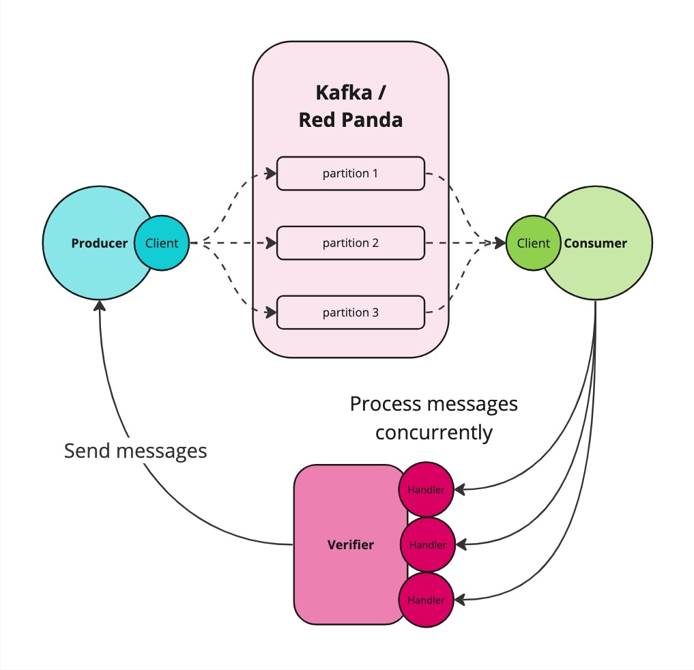

<div align="center">
  <h1>Kafka Producer Consumer Tester</h1>

  
  
  
  
  
  

</div>

## Table of Contents
- [Assessment Description](#assessment-description)
- [Getting Started](#getting-started)
  - [Prerequisites](#prerequisites)
  - [Installation](#installation)
  - [Running](#running)
    - [Option A: Local Execution with Docker Support](#option-a-local-execution-with-docker-support)
    - [Option B: Run with full Docker Support](#option-b-run-with-full-docker-support)
- [Solution Overview](#solution-overview)
  - [Architecture and Components](#architecture-and-components)
  - [Design Considerations](#design-considerations)
  - [High-Level Architecture Diagram](#high-level-architecture-diagram)
  - [Impact on Efficiency, Reliability, and Scalability](#impact-on-efficiency-reliability-and-scalability)
- [Demo](#demo)
- [Contributing](#contributing)
- [License](#license)

## Assessment Description

This assessment is designed as an example to evaluate the skills relevant to Kafka, event-driven architecture, and data persistence. The task is to create a system that involves:

1. **Kafka Producer:** Generates and publishes 1000 messages in batches to a Kafka topic. Each message carries a state: either *failed*, *completed*, or *in-progress*.

2. **Kafka Consumer:** Subscribes to the topic, reads the messages, and categorizes them based on their state. The messages are then stored in a persistent storage system according to their categorized state.

3. **Testing Suite:** Ensures comprehensive testing to verify that no messages are dropped during the process and all messages are correctly classified into their respective states.

The goal is to demonstrate proficiency in handling streaming data, ensuring data integrity, and implementing a testable, event-driven system.


## Getting Started

### Prerequisites

- **Docker**: Ensure Docker is installed and operational for running Redpanda.
- **Golang**: Version 1.22 or newer must be installed for running the application locally.
- **Make**: Make sure `make` is available to manage project commands.

**Overview:**
Red Panda will be deployed with Docker Compose for a reliable Kafka-compatible environment while executing the Golang app locally to utilize dynamic, interactive `termui` logs for real-time feedback.

### Installation

1. Clone the repository: `git clone https://github.com/raw-leak/kafka-producer-consumer-tester.git`
2. Navigate to the project directory: `cd kafka-producer-consumer-tester`

### Running

#### Option A: Local Execution with Docker Support

This setup uses Docker Compose to run Red Panda, ensuring a stable, isolated environment for the Kafka-compatible message broker. Meanwhile, the Golang application is executed locally, allowing developers to utilize interactive termui logs for real-time monitoring of produced-consumed messages and partition-processor status.

Run the following command:

```bash
make rock-local
```

It will execute `rock-local.sh` script, which will automates the setup and execution of a Kafka Producer-Consumer testing scenario:

- **1. Redpanda Startup**: Initiates a Red Panda container.

- **2. Topic Initialization**: Once Red Panda is ready, a specific Kafka topic named `test` is created with three partitions.

- **3. Application Execution**: The main component of the test, the `kafka-producer-consumer-tester`, is executed locally on your machine. Running this locally allows for immediate feedback and easier debugging.

- **4. Clean-up Operations**: Regardless of the test outcomes, the script ensures that all services started within Docker are properly shut down.

#### Option B: Run with full Docker Support

This setup uses Docker Compose to run Red Panda, ensuring a stable, isolated environment for the Kafka-compatible message broker, and the Golang application. This approach does not support using interactive termui logs for real-time monitoring of produced-consumed messages and partition-processor status. For this reason, the logs will be very reduced.

Run the following command:

```bash
make rock
```

It will execute `rock.sh` script, which will automates the setup and execution of a Kafka Producer-Consumer testing scenario:

- **1. Redpanda Startup**: Initiates a Red Panda container.

- **2. Topic Initialization**: Once Red Panda is ready, a specific Kafka topic named `test` is created with three partitions.

- **3. Application Execution**: The main component of the test, the `kafka-producer-consumer-tester`, is executed built and executed in Docker.

- **4. Clean-up Operations**: Regardless of the test outcomes, the script ensures that all services started within Docker are properly shut down.

## Solution Overview

This solution is architecturally robust, deliberately embracing what might seem like an over-engineering approach to highlight clear responsibility separation, clean abstraction layers, and effective use of design patterns. Here’s a breakdown of how the system is structured and the rationale behind key design decisions:

### Architecture and Components

- **Internal Domains**: 
  - **`/internal/app/verifier`**: At the core of the solution is the _verifier_ domain, which serves the primary purpose of verifying the integrity and state categorization of messages processed through Kafka. This component is pivotal to ensuring that messages are correctly produced, consumed, and logged without loss.

- **Internal Packages**: 
  - **`/internal/pkg/producer`**: Responsible solely for sending messages, the producer package is designed as a utility with a singular focus to streamline message dispatching to Kafka.

  - **`/internal/pkg/consumer`**: This package manages the consumption of messages from Kafka, tailored to handle large volumes (up to 1,000 messages per fetch) to optimize throughput and efficiency.
    
  - **`/internal/pkg/logger`**: Facilitates real-time logging, displaying vital information dynamically, crucial for monitoring and debugging during operation.

- **Initialization**: 
  - `/cmd/kafka-producer-consumer-tester/main.go`: Where all components/packages are initialized and dependencies injected, ensuring a clean and manageable startup process. The design follows dependency injection principles to facilitate better testing and scalability.

### Design Considerations

- **Interface-based Component Interaction**: Adhering to SOLID principles, components interact through well-defined interfaces, enhancing modularity, facilitating easier testing, and allowing for flexible future adaptations without extensive refactoring.

- **Concurrency and Parallel Processing**: Each Kafka partition has a corresponding goroutine in the consumer component, enabling parallel processing of messages. This design leverages Golang's concurrency features alongside Kafka’s distributed nature to maximize efficiency and throughput.

- **Fetch Configuration and Timing**: The consumer configuration is optimized for batch processing, fetching approximately 1MB of messages—roughly 1,000 messages per action (see the basic message size calculation). A timeout of 5 seconds ensures that fetches occur even if the full batch isn't filled, balancing latency and throughput efficiently. This setup is adjustable based on operational needs, whether prioritizing real-time responsiveness or cost-efficient batch processing.

    - Basic message size calculation: The payload of the message will contain an UUID and the state, so the JSON could be roughly formatted as: 
    
      ```json
      {
        "id": "123e4567-e89b-12d3-a456-426614174000",
        "state": "<state>"
      }
      ```
  
      This JSON, including some additional characters for formatting, might be around 100 bytes per message.


### High-Level Architecture Diagram


### Impact on Efficiency, Reliability, and Scalability
The chosen architecture not only clarifies individual component responsibilities but also ensures that the system can scale efficiently and maintain high reliability. The use of interfaces and dependency injections makes the system highly testable and maintainable, while the strategic use of concurrency optimizes resource utilization and performance.

## Demo

For a detailed demonstration of how to use our "Option A: Local Execution with Docker Support" solution, watch the demo below:


## Contributing

Please read [CONTRIBUTING.md](https://github.com/raw-leak/kafka-producer-consumer-tester/CONTRIBUTING.md) for details on our code of conduct, and the process for submitting pull requests to us.

## License

This project is licensed under the MIT License - see the [LICENSE](LICENSE) file for details.
